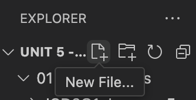

# Creating A Python File in VS Code
1. Click the New File button by hovering over the folder name: 

2. Type in the name of the file. **Always make sure you put `.py` at the end of the file name!!!** This will tell VS Code that this is a Python file. 
